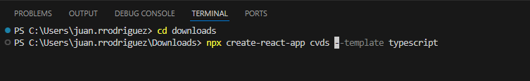
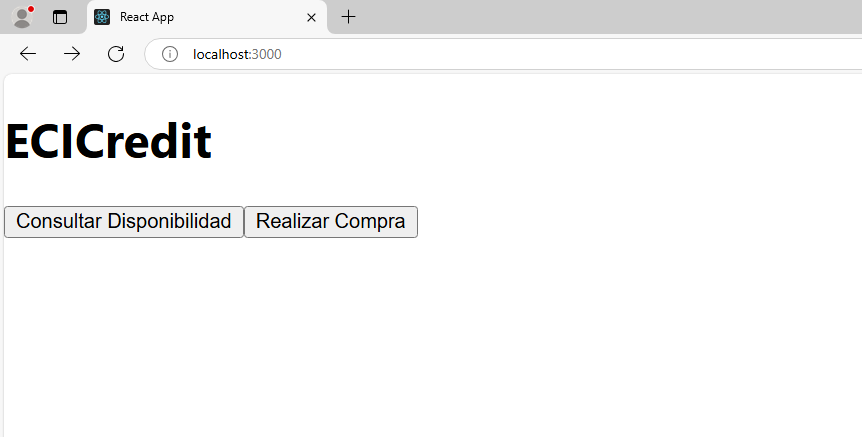
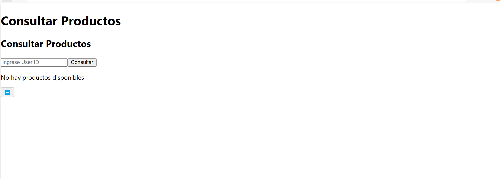
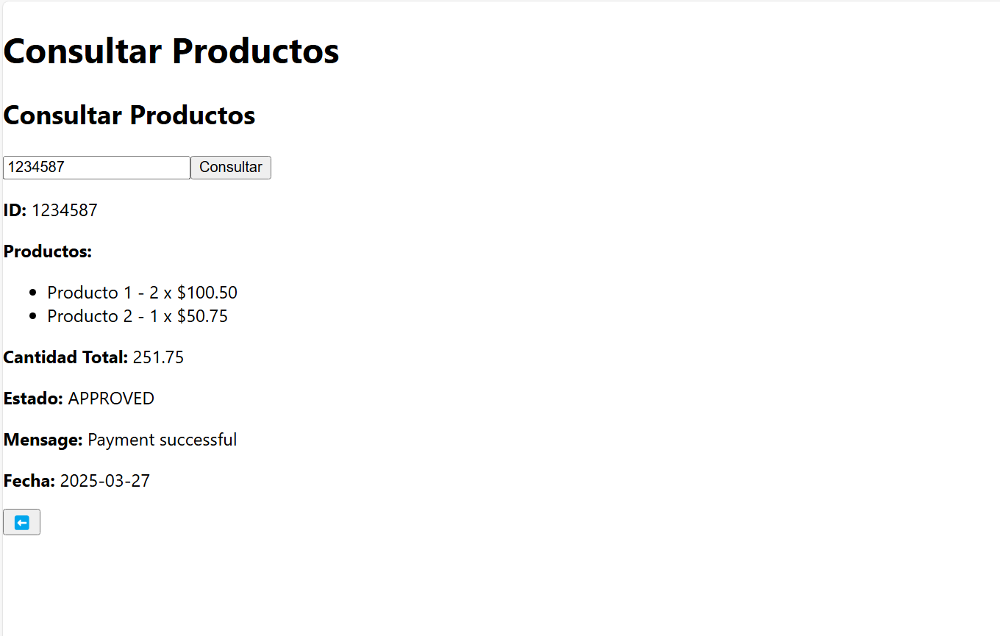
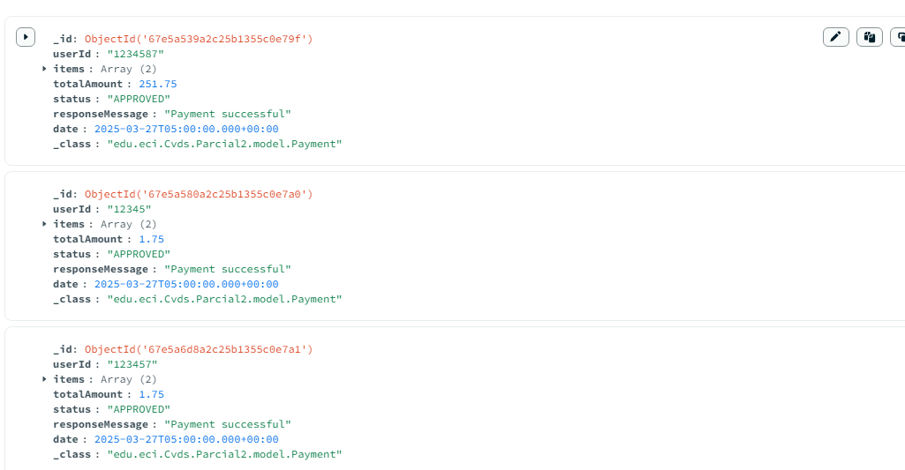

1)Creamos la estructura del Scaffolding con ayuda del comando de React que se ve en la imagen 

2)Asi se ve la pagina pero con una red local y sin desplegar aun el back

3)Esa es la ventana en la cual el usuario puede digitar el id y se muestra las que tiene a su nombre

4)asi es como se veria el registro del usuario

5) No alcance a conectar la parte del registrar las compras, por lo cual desde el front no se puede hacer, pero si se quiere probar asjunto imagen con alguno usuarios ya creador par probar el colsutar del front (con el userId) 

6) Como el back ya quedo desplegado, ahora procedemos a cambiar la URL `http://localhost:8000/payment-service/user/${userId}` por https://cvdsparcial-cscrbwgcdhebh5eg.canadacentral-01.azurewebsites.net/
